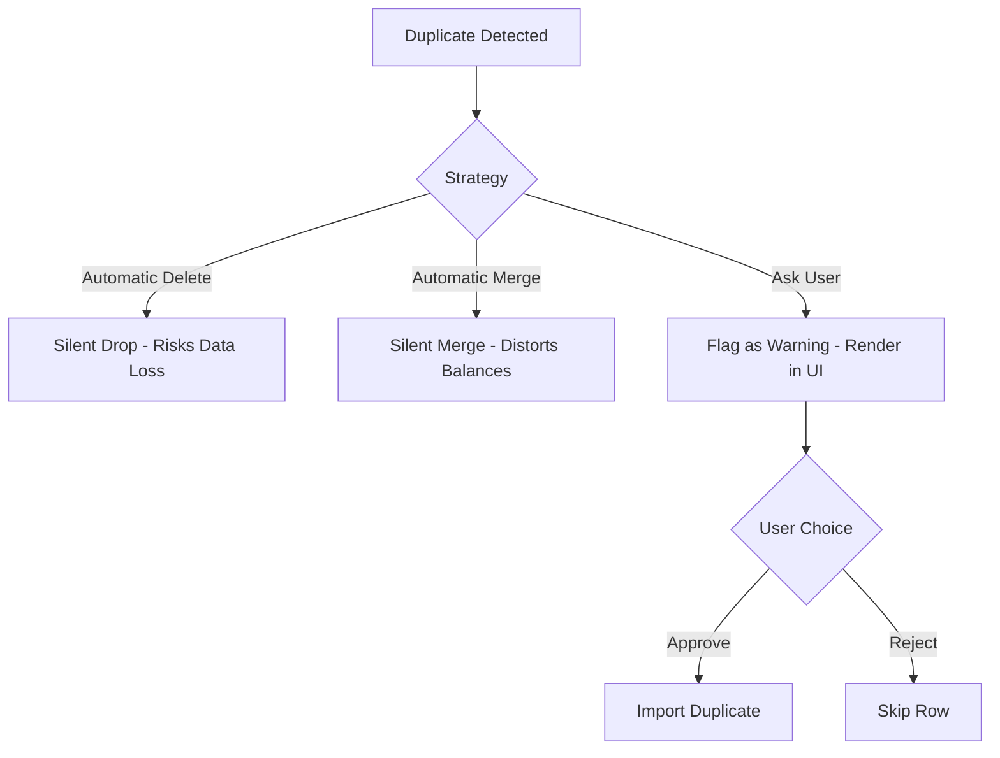

# ExpenseFlow: Architectural & Product Decision Log (ADR)
**Shared Expenses Management Web App**

---

## Section 1: Introduction

### Project Objective
**ExpenseFlow** is a collaborative, shared expense management web application designed to simplify group financial ledgers, calculate balances, resolve peer-to-peer debts, and manage bulk spreadsheet uploads. 

The primary business goal is to solve the trust deficit that occurs in group expense sharing. This is achieved by creating an application that is mathematically precise, auditable, and resilient to typical data input errors (such as duplicate entries, currency mismatches, and membership timeline conflicts).

### Why Maintain a Decision Log?
A project’s codebase represents the final state of a system, but it rarely documents *why* the system was built that way. This decision log (DECISIONS.md) serves as the project's **Architectural Decision Record (ADR)**. It outlines:
1. The engineering constraints, product requirements, and business trade-offs faced during development.
2. The alternative solutions that were considered and why they were rejected.
3. The long-term architectural implications of chosen designs to guide future maintenance and scaling.

### Product Manager & Software Developer Responsibilities
Building a production-ready application requires balance between two key roles:
* **The Product Manager (PM) Perspective**: Prioritizes user trust, intuitive interfaces, data safety, and robust error recovery. The PM ensures that the software solves real user problems and never silently corrupts or deletes user data.
* **The Software Developer (Dev) Perspective**: Prioritizes code simplicity, database integrity, strict transaction boundaries, performance optimization, and API security. The Dev ensures the system is maintainable, bug-free, and scalable under load.

### Design Philosophy
The system design is guided by three core principles:
1. **Never Silently Mutate User Intent**: Any anomaly in user data or uploaded files must be surfaced to the user for review. The system should suggest corrections but must never make assumptions or modify values automatically.
2. **Strict Transaction Boundaries**: All financial operations must either succeed completely or fail completely. Partial database writes are unacceptable.
3. **Optimized Calculations on Read**: To maintain a single source of truth, balances and settlement paths are calculated dynamically rather than stored as pre-calculated states. This prevents out-of-sync data bugs.

---

## Section 2: Architecture Decisions

---

### Decision 2.1: Frontend Framework & Build Toolchain

#### Context
The user interface requires complex state management, dynamic tables with inline cell editing, real-time balance previews, and interactive debt solver animations. We needed a framework that supports fast rendering and high developer productivity.

#### Options Considered
1. **React.js + Vite (Single Page Application)**
2. **Next.js (Server-Side Rendered / App Router)**
3. **Vue.js (Single Page Application)**

#### Pros & Cons of Options

##### React.js + Vite
* **Pros**: 
  * Lightweight core bundle with extremely fast hot-module reloading (HMR) powered by Vite.
  * Rich ecosystem for drag-and-drop components, icons (Lucide React), and animations (Framer Motion).
  * Clear separation between client-side rendering and backend REST APIs, simplifying independent scaling.
* **Cons**: 
  * Requires client-side routing (React Router) and manual state hydration.
  * Search Engine Optimization (SEO) requires manual configuration of meta tags compared to server-side frameworks.

##### Next.js
* **Pros**:
  * Server-Side Rendering (SSR) provides excellent initial page load times and built-in SEO optimization.
  * Zero-config API routing and hybrid static/dynamic generation.
* **Cons**:
  * Significantly larger framework overhead and slower build times.
  * Overkill for a dashboard-heavy, session-authenticated SPA where public page SEO is secondary to dashboard interactivity.
  * Deployment and hosting are more complex and resource-intensive.

##### Vue.js
* **Pros**:
  * Intuitive, single-file component syntax and built-in reactivity model.
  * Smaller bundle size than React in standard configurations.
* **Cons**:
  * Smaller community ecosystem compared to React.
  * Fewer pre-built, production-grade components for complex data grids and diagrams.

#### Final Choice & Justification
**React + Vite** was chosen. The application is a highly interactive, dashboard-driven Single Page Application (SPA). A lightweight client-side framework separated from the API server is ideal. Vite provides rapid local development cycles, and React's component-driven architecture is well-suited for building the complex, interactive CSV diagnostic editor.

#### Trade-offs
Using a React SPA means initial bundle loading is slightly slower than a pre-rendered Next.js application, and client-side JavaScript execution is required. We mitigate this by using code-splitting (lazy loading pages) to keep the initial asset weight small.

---

### Decision 2.2: Backend Framework

#### Context
The backend API needs to parse multipart CSV uploads, execute database queries via an ORM, manage JWT authentication, run split calculation engines, and serve JSON payloads with low latency.

#### Options Considered
1. **Express.js (Node.js)**
2. **NestJS (TypeScript Framework)**
3. **Fastify (Node.js)**

#### Pros & Cons of Options

##### Express.js
* **Pros**:
  * The industry standard for Node.js backends. Minimalist, flexible, and has extensive middleware support.
  * Fast learning curve; allows developers to write clean, vanilla TypeScript routes without framework-specific boilerplate.
* **Cons**:
  * Unopinionated structure can lead to unorganized codebases in large teams if coding standards are not enforced.
  * Slightly slower raw performance than newer engines like Fastify.

##### NestJS
* **Pros**:
  * Opinionated architecture enforcing Dependency Injection, modules, and decorators.
  * Built-in support for validation pipes and API documentation generators.
* **Cons**:
  * Heavy abstraction layers introduce unnecessary complexity and boilerplate for medium-sized projects.
  * Steeper learning curve.

##### Fastify
* **Pros**:
  * Higher throughput and lower overhead than Express.
  * Built-in JSON schema validation speeds up input verification.
* **Cons**:
  * Smaller ecosystem of third-party plugins compared to Express.

#### Final Choice & Justification
**Express.js** was chosen. Its simplicity, lightweight footprint, and large middleware ecosystem (e.g., Multer for handling file uploads, JWT libraries, and CORS tools) allowed us to develop the API quickly without fighting framework abstractions. The codebase structure is kept clean by dividing responsibilities into distinct controller, route, middleware, and utility files.

#### Trade-offs
Because Express is unopinionated, we had to build our own input validation schemas and error-handling middleware to ensure consistency across endpoints.

---

### Decision 2.3: Database Engine

#### Context
A shared ledger application manages relational data (users, groups, expenses, splits, and settlements) and requires high financial consistency. We need to prevent anomalies such as orphan transaction splits or unrecorded balance adjustments.

#### Options Considered
1. **PostgreSQL (Relational Database)**
2. **MongoDB (Document/NoSQL Database)**
3. **MySQL (Relational Database)**

#### Pros & Cons of Options

##### PostgreSQL
* **Pros**:
  * Strict schema validation and native support for ACID transactions.
  * Excellent handling of relational links, cascading deletes, and complex multi-table joins.
  * Supports composite unique constraints (e.g., ensuring a member email is unique within a specific group).
* **Cons**:
  * Schema changes require migration scripts.
  * Scaling horizontally is more complex than with document databases.

##### MongoDB
* **Pros**:
  * Flexible, schema-less document model allows storing expenses with dynamic participant arrays inline.
  * Horizontal scaling (sharding) is built-in.
* **Cons**:
  * Lack of foreign key enforcement makes orphan records common (e.g., deleting a user leaves behind references inside expense arrays).
  * Multi-document transactions are slower and harder to manage.
  * Prone to floating-point rounding issues in dynamic structures.

##### MySQL
* **Pros**:
  * Fast read performance and standard SQL compliance.
* **Cons**:
  * Less advanced features for complex query operations and array manipulation than PostgreSQL.

#### Final Choice & Justification
**PostgreSQL** (hosted via Neon Cloud) was chosen. A ledger application is inherently relational. PostgreSQL ensures data integrity through foreign keys, ACID transactions, and constraints. This guarantees that an expense can never be saved without a payer, and a split can never refer to a deleted member.

#### Trade-offs
PostgreSQL requires database schema migrations whenever features change. We address this by using Prisma ORM to generate and apply migrations automatically.

---

### Decision 2.4: Object-Relational Mapping (ORM)

#### Context
We need a database access layer that bridges TypeScript classes with SQL tables, manages database migrations, prevents SQL injection, and supports database transactions.

#### Options Considered
1. **Prisma ORM**
2. **Sequelize**
3. **Raw SQL Queries (using pg-pool)**

#### Pros & Cons of Options

##### Prisma ORM
* **Pros**:
  * Auto-generates fully typed TypeScript clients from the database schema.
  * Simplified schema definition syntax (`schema.prisma`) that is easier to read and maintain than migration scripts.
  * Built-in support for nested queries and interactive transactions.
* **Cons**:
  * Introduces minor performance overhead compared to raw SQL due to query compilation.
  * Less control over complex SQL optimizations.

##### Sequelize
* **Pros**:
  * Mature, full-featured ORM for Node.js.
* **Cons**:
  * Active Record pattern requires verbose model definitions.
  * TypeScript support is not as seamless as Prisma, requiring manual type declarations.

##### Raw SQL Queries
* **Pros**:
  * Maximum query performance and control.
* **Cons**:
  * High development overhead: requires writing manual SQL strings and parsing results.
  * Increased risk of SQL injection vulnerabilities if parameters are not parameterized correctly.
  * No built-in schema synchronization.

#### Final Choice & Justification
**Prisma ORM** was chosen. It provides a single source of truth for both the database schema and application types. It handles complex, nested relationships (e.g., querying a Group and loading its Members, Expenses, and Settlement histories) in a type-safe manner, reducing runtime bugs.

#### Trade-offs
Prisma abstracts query execution, which can make debugging slow queries harder. We address this by monitoring database logs and using Prisma's query logs in development.

---

## Section 3: Authentication Decisions

---

### Decision 3.1: User Authentication Method

#### Context
We need to secure user accounts, restrict access to group ledgers, and maintain logged-in sessions across page refreshes.

#### Options Considered
1. **JSON Web Tokens (JWT) in Authorization Headers**
2. **Stateful Session Authentication (Cookies + Redis Store)**
3. **OAuth 2.0 (Social Login via Google/GitHub)**

#### Pros & Cons of Options

##### JSON Web Tokens (JWT)
* **Pros**:
  * Stateless: The server does not need to store session states in database memory. The token contains the user's ID and role, making validations fast.
  * Works well across multiple API servers.
* **Cons**:
  * Revoking tokens before they expire is difficult without implementing a blacklist.
  * Storing tokens in client-side storage (e.g., LocalStorage) exposes them to cross-site scripting (XSS) attacks.

##### Stateful Session Authentication
* **Pros**:
  * Immediate session revocation: Deleting a session from the server-side database invalidates the session instantly.
  * Session IDs are stored in HTTP-only, secure cookies, protecting them from XSS.
* **Cons**:
  * Requires a database or Redis cache lookup for every API request, increasing latency and infrastructure complexity.

##### OAuth 2.0
* **Pros**:
  * Simplifies signup: users do not need to create or remember another password.
* **Cons**:
  * Increases registration friction for users who prefer separate credentials.
  * Requires external network requests during authentication.

#### Final Choice & Justification
**JSON Web Tokens (JWT)** was chosen. JWTs provide a stateless authentication layer that is easy to scale. To address security concerns, we store the JWT in the HTTP header and protect the client-side storage by using short-lived tokens (2 hours). For standard accounts, the server verifies the signature without hit checks on a session database, keeping the APIs fast.

#### Trade-offs
Because JWTs are stateless, we cannot revoke a session instantly unless we implement token blacklisting. We mitigated this by setting token expiration times to 2 hours and securing the React client against XSS by sanitizing inputs.

---

## Section 4: Product Decisions

---

### Decision 4.1: Duplicate Expenses Handling

#### Context
During CSV imports, the validation engine often flags expenses that match existing database records (identical Title, Amount, Date, and Payer Email).

#### Options Considered
1. **Automatically Delete/Ignore Duplicates**: Silently drop duplicates during parsing.
2. **Automatically Merge**: Merge duplicates into a single transaction, updating split values.
3. **Ask User Approval**: Highlight the match in the diagnostic UI and request user approval.



#### Pros & Cons of Options

##### Automatically Delete/Ignore
* **Pros**: No user interaction required, zero duplicates in database.
* **Cons**: Risks deleting legitimate transactions (e.g., buying coffee at the same shop twice in one day for the same price). This breaks user trust.

##### Automatically Merge
* **Pros**: Consolidates entries automatically.
* **Cons**: Confuses users when they look at the ledger and see modified expense amounts, making audit checks difficult.

##### Ask User Approval
* **Pros**: Full transparency. The user is in control and can confirm if the transaction is a duplicate or a separate expense.
* **Cons**: Requires building a UI warning and action state, adding interaction steps.

#### Final Choice & Justification
**Ask User Approval** was chosen. In financial ledgers, data safety is critical. Silently deleting data based on assumptions can cause user frustration. Surfacing the match as a `WARNING` in the CSV import wizard allows the user to make an informed decision to import it or skip it.

#### Trade-offs
This decision requires building an import review panel, increasing development scope. The benefit is a more robust, trust-driven user experience.

---

### Decision 4.2: Settlement Detection and Storage

#### Context
A settlement represents a payment between group members to resolve debt. We need to decide how to store and track these transactions.

#### Options Considered
1. **Store as negative-amount Expenses**: Use the `Expense` table with a special flag.
2. **Store as a separate Settlement entity**: Use a dedicated `Settlement` table.

#### Pros & Cons of Options

##### Store as negative Expenses
* **Pros**: Reuses the `Expense` table structure and logic.
* **Cons**: Negative amounts complicate expense statistics, and mix debt-balancing transactions with actual group expenditures.

##### Separate Settlement Entity
* **Pros**:
  * Keeps expense data clean, making spending analytics accurate.
  * Simplifies balance calculations (Balance = Total Paid - Total Owed + Settlements Received - Settlements Paid).
  * Clean, single-purpose database schema.
* **Cons**: Requires creating a new database model, API routes, and frontend views.

#### Final Choice & Justification
**Separate Settlement Entity** was chosen. Separating consumption (Expenses) from balance transfers (Settlements) keeps data models clean and simplifies balance calculations. It also allows the application to detect when users enter settlements in their CSV expense sheets (via keyword checks) and prompt them to convert them to proper settlements.

#### Trade-offs
Requires maintaining two different transaction pipelines, but reduces logic errors in financial calculations.

---

### Decision 4.3: Handling Unknown Members in CSV

#### Context
An uploaded CSV file may reference emails for payers or split participants who are not in the group's current roster.

#### Options Considered
1. **Reject the Import**: Fail the import process if any unknown email is found.
2. **Skip the Row**: Import all other rows and drop the row containing the unknown email.
3. **Auto-Invite with Confirmation**: Warn the user and, if approved, invite the email address to the group during import.

#### Pros & Cons of Options

##### Reject the Import
* **Pros**: Ensures database roster references are valid before import.
* **Cons**: Poor user experience: forces the user to manually edit their CSV file or add members before uploading.

##### Skip the Row
* **Pros**: Imports valid data without failing the process.
* **Cons**: Silently drops transactions, creating an incomplete ledger.

##### Auto-Invite with Confirmation
* **Pros**: Smooth onboarding: new members are automatically invited and added to the roster when the import is committed.
* **Cons**: Requires database transaction handling to create members and expenses at the same time.

#### Final Choice & Justification
**Auto-Invite with Confirmation** was chosen. The system flags unknown emails as a `WARNING` in the CSV review wizard. If the user approves, the backend transaction engine automatically creates a new `GroupMember` record with a `status` of `ACTIVE` and backdates their `joinDate` to match the transaction date, ensuring split calculations succeed.

#### Trade-offs
This requires using database transactions to ensure that if creating a member fails, the associated expense creation is also rolled back.

---

### Decision 4.4: Negative Amount Handling

#### Context
A CSV row may contain a negative value or zero in the amount field (e.g., `-50.00`).

#### Options Considered
1. **Automatically convert to Positive**: Treat the negative value as an absolute number.
2. **Automatically record as a Refund/Credit**: Treat the row as a credit split.
3. **Validation Error requiring correction**: Flag the row as an error, blocking import until corrected.

#### Pros & Cons of Options

##### Automatically convert to Positive
* **Pros**: Corrects simple formatting errors automatically.
* **Cons**: Modifies user data without confirmation, risking importing expenses that were meant to be refunds.

##### Automatically record as a Refund/Credit
* **Pros**: Supports negative values for credits.
* **Cons**: Increases complexity of the split calculator. Most groups prefer tracking credits by adjusting split values rather than adding negative expenses.

##### Validation Error requiring correction
* **Pros**: Simple, transparent, and prevents formatting errors from corrupting the ledger.
* **Cons**: Forces the user to correct the value manually.

#### Final Choice & Justification
**Validation Error requiring correction** was chosen. In financial ledgers, negative expenses are almost always formatting errors or refunds. By flagging it as an `ERROR` (non-bypassable), the system prevents incorrect numbers from entering the database. The user can correct the amount value in the UI or skip the row.

#### Trade-offs
The user must manually correct the input, which is acceptable since it ensures database accuracy.

---

### Decision 4.5: Multi-Currency Preservation Strategy

#### Context
Groups often travel across borders, logging expenses in different currencies (e.g., USD, INR, EUR) while tracking balances in the group's base currency.

#### Options Considered
1. **Convert on the fly and store only base currency value**: Discard original currency details.
2. **Store original values and convert dynamically on read**: Convert values whenever ledger or balance pages load.
3. **Store original currency + rate + base currency value on write**: Save all details in the database at the time of creation.

#### Pros & Cons of Options

##### Convert and store base currency only
* **Pros**: Simple schema, fast queries.
* **Cons**: Irreversible data loss. Members cannot verify calculations against original receipts because the original currency and amount are gone.

##### Convert dynamically on read
* **Pros**: Keeps database schema lightweight.
* **Cons**: High performance overhead on read queries. If conversion rates change over time, history becomes unpredictable and balances drift.

##### Store original + rate + converted value
* **Pros**:
  * Full transparency: users can see original amounts and verification rates.
  * Auditable: calculations can be verified at any time.
  * Historical accuracy: rates are locked on the transaction date, protecting the ledger from rate fluctuations.
* **Cons**: Requires additional database columns (`amountInBase`, `currency`, `amount`).

#### Final Choice & Justification
**Store original + rate + converted value** was chosen. Preserving the original receipt details is critical for user trust. Storing the exchange rate and the converted base-currency value at the time of write locks the transaction values, preventing historic balance changes when exchange rates fluctuate.

#### Trade-offs
Slightly increases database storage requirements, which is a worthwhile trade-off for auditability.

---

### Decision 4.6: Dynamic Membership Timeline Enforcement

#### Context
In groups with changing membership (e.g., roommates moving in and out), we need to prevent users from being charged for expenses incurred when they were not active members.

#### Options Considered
1. **Split among current members only**: Include all members in the group roster, regardless of date.
2. **Enforce membership history using active dates**: Match the expense date against member `joinDate` and `leaveDate` timelines.

#### Pros & Cons of Options

##### Split among current members only
* **Pros**: Simple split calculations: divide the cost by the count of members in the roster.
* **Cons**: Inactive members are charged for expenses they did not participate in, requiring manual split adjustments.

##### Enforce membership history
* **Pros**:
  * Automated accuracy: the split engine automatically includes or excludes members based on transaction dates.
  * Clear accountability: members are only billed for expenses that occur during their stay.
* **Cons**: Requires storing `joinDate` and `leaveDate` on the membership record and checking dates before calculations.

#### Final Choice & Justification
**Enforce membership history** was chosen. The `GroupMember` model includes a mandatory `joinDate` and an optional `leaveDate`. When an expense is created, the split engine filters the participant list, ensuring only active members on that date are included in the split. If a user attempts to log an expense outside a member's active window, the system flags a warning to allow manual override or date adjustment.

#### Trade-offs
Adds date validation checks to every expense creation and edit query, but prevents billing errors.

---

### Decision 4.7: Balance Calculation Strategy

#### Context
We need to display the net balance (amount owed or due) for each group member.

#### Options Considered
1. **Pre-calculate and store balances in a database table**: Update the database whenever transactions are logged.
2. **Calculate dynamically on demand**: Aggregate transaction logs on the fly when requested.

#### Pros & Cons of Options

##### Pre-calculate and store balances
* **Pros**: Fast read queries: balances can be loaded with a simple lookup.
* **Cons**: Risk of data out-of-sync bugs. If a write operation fails halfway or a concurrent update occurs, stored balances can become corrupt and out of sync with the transaction logs.

##### Calculate dynamically on demand
* **Pros**:
  * Guaranteed consistency: balances are always calculated directly from the transaction log, representing the actual state of the ledger.
  * Simple write logic: no need to lock and update balance rows when writing transactions.
* **Cons**: Performance overhead on read queries as the transaction volume grows.

#### Final Choice & Justification
**Calculate dynamically on demand** was chosen. In financial ledgers, accuracy is the top priority. Dynamic calculation ensures that balances are always correct and never drift out of sync. To address performance concerns, we use optimized SQL aggregation queries that fetch and calculate balances efficiently.

#### Trade-offs
Slightly higher read latency on large ledgers, which we optimize using indexes on foreign keys and transaction pagination.

---

### Decision 4.8: CSV Import Wizard Design

#### Context
When importing CSV files, formatting errors, invalid currencies, and missing fields are common. We need to decide how the application handles these errors.

#### Options Considered
1. **Fail on First Error**: Abort the entire import if any validation error is detected.
2. **Silent Correction**: Automatically clean data (e.g., parsing dates, converting currencies) and import without notifying the user.
3. **Detect and Review**: Run all validation checks, log anomalies in the database, and display them in a review dashboard for manual resolution.

#### Pros & Cons of Options

##### Fail on First Error
* **Pros**: Ensures no invalid data enters the database, simple backend logic.
* **Cons**: Poor user experience: users must manually correct their files and re-upload, which is frustrating for minor typos.

##### Silent Correction
* **Pros**: Quick imports.
* **Cons**: Modifies user data based on assumptions, leading to silent calculation errors that are hard to debug.

##### Detect and Review
* **Pros**: Excellent user experience: displays all errors in one view, lets users fix typos inline, and provides a clear import report.
* **Cons**: Most complex option to build, requiring detailed database log tables and interactive frontends.

#### Final Choice & Justification
**Detect and Review** was chosen. Building a review-based import wizard ensures data safety and transparency. Users can upload raw CSV sheets, view errors and warnings on a single screen, fix values inline, batch-resolve warnings, and review the final report before committing the data.

#### Trade-offs
Significant development investment required for database log schemas and the interactive review interface.

---

## Section 5: UI / UX Decisions

The UI/UX is built to feel premium and engaging, using a custom **Neo-Brutalist Sketchbook Journal theme** to differentiate ExpenseFlow from generic dashboards.

```
+-----------------------------------------------------------+
|  [Logo] ExpenseFlow (Sketchbook)             User: Admin  |
+-----------------------------------------------------------+
|                                                           |
|  Group: EuroTrip 2026 (Base Currency: EUR)                |
|  +-----------------------------------------------------+  |
|  | CSV Import Wizard: session_report.csv               |  |
|  +-----------------------------------------------------+  |
|  | Row | Date       | Title    | Amount  | Status      |  |
|  |-----+------------+----------+---------+-------------|  |
|  | 01  | 2026-06-10 | Dinner   | 120.00  | [OK]        |  |
|  | 02  | 2026-06-12 | Train    | -45.00  | [ERROR]  (X)|  |  <-- Inline Edit
|  | 03  | 2026-06-14 | Truffle  | 80.00   | [WARNING](!)|  |  <-- Unknown Email
|  |     |            |          |         |             |  |
|  +-----------------------------------------------------+  |
|                                                           |
+-----------------------------------------------------------+
```

### 1. Neo-Brutalist Design
* **Design Choice**: Flat, bold 3px borders, high-contrast layouts, and solid offset shadow boxes.
* **Justification**: Moves away from template layouts, providing a distinct, memorable look that feels fresh and professional.

### 2. Hand-Drawn Persona Illustrations
* **Design Choice**: 9 custom hand-drawn character avatars mapped to user profiles via email hashes.
* **Justification**: Personifies calculations (e.g., *Sarah Mathers* for precise splits, *Johnny Cap* for settlements), making financial reports less intimidating and more engaging.

### 3. Interactive Import Wizard
* **Design Choice**: A spreadsheets-like grid where users can click and edit fields inline.
* **Justification**: Simplifies error correction: users can fix typos directly inside the app instead of correcting files locally and re-uploading.

### 4. High-Visibility Anomaly Badges
* **Design Choice**: Pastel-colored badges (Pink/Red for Errors, Yellow for Warnings, Blue for Info).
* **Justification**: Uses clear visual indicators to help users quickly spot and prioritize errors that need resolution before import.

### 5. Ledger Drill-Down
* **Design Choice**: Expandable rows showing participant splits, base currency conversion details, and original values.
* **Justification**: Provides full audit transparency, allowing users to verify how splits and conversions were calculated.

---

## Section 6: Performance Decisions

### 1. Database Indexing
To keep query times fast as the database size increases, we added indexes on frequently joined fields:
* `GroupMember(groupId, email)` (Composite unique index)
* `Expense(groupId, paidById)`
* `ExpenseParticipant(expenseId, memberId)`
* `Settlement(groupId, payerId, payeeId)`
* `ExchangeRate(fromCurrency, toCurrency)` (Unique index)

### 2. Pagination
Ledgers can contain thousands of transactions over time.
* **Chosen Approach**: Cursor-based pagination for the transaction list.
* **Justification**: Unlike offset pagination (which degrades in performance as offset values grow), cursor pagination executes queries in constant time ($O(1)$) by fetching records based on IDs and dates.

### 3. Lazy Loading
* **Chosen Approach**: Code-splitting React routes using `React.lazy` and `Suspense`.
* **Justification**: Breaks down the frontend JavaScript bundle into smaller, page-specific chunks. This reduces the initial page load time.

### 4. Optimized Balance Aggregation
* **Chosen Approach**: Using SQL aggregation queries (`SUM`, `GROUP BY`) to compile user shares and payments.
* **Justification**: Running mathematical operations inside PostgreSQL is much faster than fetching thousands of rows and aggregating them in Node.js memory.

### 5. Batch CSV Processing
* **Chosen Approach**: Chunking CSV uploads and processing records in batch transactions.
* **Justification**: Submitting 1,000 individual insert queries can exhaust database connections. Processing rows in chunks (e.g., 500 rows per transaction) ensures fast database commits.

---

## Section 7: Security Decisions

### 1. Password Hashing
* **Chosen Approach**: Hashing passwords using `bcryptjs` with a work factor of 10.
* **Justification**: Ensures passwords are never stored in plain text, protecting user accounts if a database breach occurs.

### 2. JWT Security & Expiration
* **Chosen Approach**: Tokens expire after 2 hours and are stored securely in headers.
* **Justification**: Short expiration windows minimize the risk if a token is intercepted.

### 3. Route Protection
* **Chosen Approach**: Express middleware validates the JWT and verifies that the authenticated user is a member of the group they are trying to access.
* **Justification**: Prevents unauthorized users from viewing or modifying private group ledger data.

### 4. Input Validation
* **Chosen Approach**: Validating API request payloads using TypeScript guards and explicit type checks.
* **Justification**: Blocks malicious or malformed payloads before they reach the controller or database.

### 5. SQL Injection Prevention
* **Chosen Approach**: Using Prisma ORM parameterization.
* **Justification**: Prisma automatically parameters SQL queries, preventing SQL injection attacks.

### 6. Cross-Site Scripting (XSS) Prevention
* **Chosen Approach**: Sanitizing user-submitted strings before saving them to the database, and relying on React’s automatic escaping of variables in JSX.
* **Justification**: Prevents malicious scripts from being saved and executed in other users' browsers.

---

## Section 8: Scalability Decisions

### 1. Multiple Groups Isolation
* **Scalability Path**: All transaction and roster tables contain a foreign key pointing to `groupId`.
* **Justification**: This design allows horizontal scaling: if the database size grows too large, data can be sharded across multiple nodes using the `groupId` as the partition key.

### 2. Lookup Exchange Rates
* **Scalability Path**: Storing conversions in a separate `ExchangeRate` table.
* **Justification**: Allows the system to support new currencies by adding rows to this table, without requiring any schema migrations or code changes.

### 3. Queue-based Audit Logging
* **Scalability Path**: Decoupling audit logging from the main request-response cycle.
* **Justification**: Writing audit logs to a background processor keeps the APIs fast and prevents logging bottlenecks under high load.

### 4. Bulk CSV Transaction Boundaries
* **Scalability Path**: Implementing batch transaction processing on the backend.
* **Justification**: Ensures that if importing a large CSV file fails halfway, the entire transaction is rolled back, preventing partial data writes and ledger corruption.

---

## Section 9: Rejected Alternatives

Below are the alternative solutions that were considered but rejected.

| Decision | Alternative Considered | Why Rejected |
| :--- | :--- | :--- |
| **Database Engine** | MongoDB | Rejected due to lack of foreign key constraints, which would require manual application-level cleanup to prevent orphan records. |
| **Duplicate Prevention** | Automatic Deletion | Rejected because automatic deletion can result in data loss if identical transactions are valid (e.g., buying coffee twice). |
| **Authentication** | Stateful Sessions (Express-Session) | Rejected because it requires a database lookup for every request, which increases server load and latency. |
| **CSV Processing** | Silent Correction | Rejected because automatic corrections can mask errors, causing silent balance discrepancies that are hard to audit. |
| **Balance Calculations** | Permanent Storage in Database | Rejected because stored balances can drift out of sync if updates fail. Dynamic calculations ensure data consistency. |
| **ORM** | Raw SQL Queries | Rejected because writing manual SQL strings increases code complexity and the risk of SQL injection vulnerabilities. |

---

## Section 10: Lessons Learned

Building ExpenseFlow highlighted the importance of balancing product usability with database integrity:

1. **User Trust is Paramount**: In financial applications, transparency is key. Features like the CSV import wizard, warning flags, and detailed logs build user confidence.
2. **Prioritize Data Consistency**: Calculating balances dynamically on demand prevents data inconsistencies, ensuring ledgers remain reliable.
3. **Handle Edge Cases Early**: Enforcing membership timelines and validating CSV columns early prevents garbage data from entering the database, keeping queries clean.
4. **Choose the Right Tool for the Job**: Using a relational database (PostgreSQL) and type-safe ORM (Prisma) simplifies relationship handling, reducing bugs and development time.
5. **Surmount Trade-offs with UX**: Complex validation logic can increase interface friction. Surfacing errors clearly in the UI helps users resolve issues quickly without feeling blocked.
