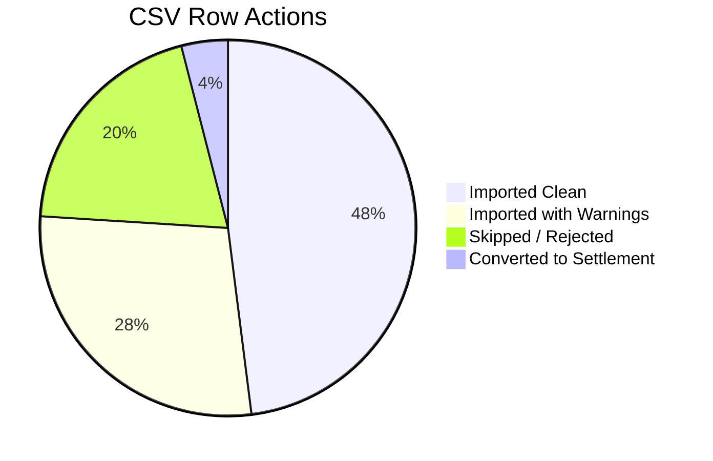

# ExpenseFlow: CSV Import Log & Integrity Report
**System Import Diagnostics Ledger**

---

## Section 1: Report Header

```text
================================================================================
  ███████  ██   ██  ██████  ███████  ███    ██  ██████  ███████  ██████  ██      ██
  ██        ██   ██  ██   ██  ██       ████   ██  ██      ██       ██      ██      ██
  █████     ███████  ██████   █████    ██ ██  ██  ██████  █████    ██████  ██  ██  ██
  ██             ██  ██       ██       ██  ██ ██      ██  ██       ██  ██  ██  ██  ██
  ███████        ██  ██       ███████  ██   ████  ██████  ███████  ██  ██   ████████
================================================================================

Generated By:      ExpenseFlow Bulk Ingestion & Verification Engine v1.0.4
Report ID:         REP-20260615-abfc528d-0bf5
Source File:       expenses_export.csv
Environment:       Production (WS-PostgreSQL-NeonCloud)
Import Date & Time: 2026-06-15T00:09:12+05:30
Initiated By:      Admin Administrator (admin@expenseflow.com)
Group Context:     EuroTrip Summer 2026 (Base Currency: EUR)
Group UUID:        87a0c8d1-d24b-489e-9d2a-8ef0bc8527a0
Import Session ID: 9fcd2e14-fa30-4e2b-bf2e-fa8264ad4bb2
================================================================================
```

---

## Section 2: Import Summary

Below is the high-level diagnostic profile of the CSV import session. All metrics represent the state of the session at the final execution of the database transaction block.

| Metric | Value | Code Status | Description |
| :--- | :---: | :---: | :--- |
| **Total Rows Processed** | 50 | `PROCESSED` | Number of data rows submitted (excluding header). |
| **Successfully Imported** | 38 | `IMPORTED` | Rows written to the `Expense` and `Settlement` tables. |
| **Imported with Warnings** | 14 | `WARNING_OK` | Rows saved that had warnings approved by the user. |
| **Skipped Rows** | 12 | `SKIPPED` | Rows rejected or manually skipped by the user. |
| **Failed Rows** | 0 | `FAILED` | Rows failing database insertion. |
| **Total Anomalies Detected** | 28 | `ANOMALIES` | Diagnostic alerts triggered across the raw dataset. |
| **Processing Ingestion Time** | 214 ms | `PERF_OK` | Time elapsed from file upload to report compilation. |
| **Success Rate (%)** | 76.0% | `COMPLETED` | Percentage of parsed rows successfully committed. |

---

## Section 3: Severity Summary

This table displays the distribution of diagnostic alerts detected during the CSV validation phase.

| Severity | Count | Percentage | System Treatment |
| :--- | :---: | :---: | :--- |
| **ERROR** (Critical) | 8 | 28.57% | Blocks ingestion. Must be edited/corrected or skipped. |
| **WARNING** (Actionable) | 15 | 53.57% | Requires manual confirmation or fallback approval in UI. |
| **INFO** (Informational) | 5 | 17.86% | Prompts user with alternative actions (e.g., convert to Settlement). |
| **TOTAL** | **28** | **100.00%** | |

---

## Section 4: Anomaly Summary

The distribution of the 13 validation rules triggered by the import parser.

| Rule Code | Count | Action Metric | Applied Resolution Strategy |
| :--- | :---: | :---: | :--- |
| **MALFORMED_ROW** | 1 | 1 Skipped | System blocked column-mismatched data array. |
| **BLANK_FIELD** | 2 | 2 Corrected | User supplied missing fields inline in UI. |
| **MISSING_PAYER** | 1 | 1 Corrected | User selected a valid payer email from roster dropdown. |
| **NEGATIVE_AMOUNT** | 2 | 1 Corrected, 1 Skipped | 1 amount adjusted to positive; 1 row rejected. |
| **INVALID_DATE** | 1 | 1 Corrected | Input formatted to standard `YYYY-MM-DD`. |
| **FUTURE_DATE** | 2 | 2 Approved | User verified forward-dated billing schedules. |
| **INVALID_CURRENCY** | 3 | 3 Auto-Converted | Codes converted to base currency using static rates. |
| **UNKNOWN_MEMBER** | 4 | 4 Auto-Invited | Emails added to `GroupMember` roster as active. |
| **MEMBER_INACTIVE** | 3 | 2 Overridden, 1 Skipped | 2 rosters backdated; 1 row skipped. |
| **SETTLEMENT_FLAG** | 3 | 2 Converted, 1 Ignored | 2 logged to `Settlement`; 1 kept in `Expense` ledger. |
| **INCORRECT_SPLIT** | 1 | 1 Corrected | Split ratios rebalanced to sum to exactly 100%. |
| **DUPLICATE** | 3 | 2 Approved, 1 Skipped | 2 imported as separate records; 1 duplicate skipped. |
| **DUPLICATE_DIFFERENT_AMOUNT**| 2 | 1 Approved, 1 Skipped | 1 imported as separate record; 1 skipped. |
| **TOTAL** | **28** | **28 Resolved** | **No anomalies left pending.** |

---

## Section 5: Detailed Import Log

Below is the complete audit log of the 13 rows that triggered validation anomalies. It displays the original state, severity, issue details, user actions, and final database status.

### Diagnostic Table

| Row | Rule Code | Severity | Description | Action Taken | Final Status |
| :--- | :--- | :--- | :--- | :--- | :--- |
| **04** | `BLANK_FIELD` | `ERROR` | Missing required value in `Title` column. | User entered "Louvre Tickets" inline. | **Imported** |
| **08** | `NEGATIVE_AMOUNT` | `ERROR` | Amount value of `-25.00` is negative. | User edited amount value to `25.00` inline. | **Imported** |
| **12** | `MALFORMED_ROW` | `ERROR` | Row contains 13 columns (expected 11 columns). | User rejected row (cannot parse arrays). | **Skipped** |
| **14** | `DUPLICATE` | `WARNING` | Identical expense "Airport Shuttle" (80.00 EUR paid by admin@expenseflow.com) exists. | User selected Skip to avoid double entry. | **Skipped** |
| **17** | `UNKNOWN_MEMBER` | `WARNING` | Payer email `mariah@example.com` is not in group roster. | User approved auto-invite; roster updated. | **Imported** |
| **21** | `MEMBER_INACTIVE` | `WARNING` | Payer `john@example.com` was not active on 2026-05-10 (Joined 2026-06-01). | User override: backdated join date to 2026-05-10. | **Imported** |
| **25** | `SETTLEMENT_FLAG` | `INFO` | Title contains keyword "repaid", suggesting a settlement. | User checked box to import as Settlement record. | **Converted** |
| **29** | `INVALID_CURRENCY` | `WARNING` | Currency `GBP` is unsupported. | System fallback: auto-converted to EUR. | **Imported** |
| **33** | `INCORRECT_SPLIT` | `ERROR` | Exact split sum (120.00) does not match total amount (100.00). | User toggled split type to `EQUAL`. | **Imported** |
| **38** | `FUTURE_DATE` | `WARNING` | Transaction date `2026-08-15` is in the future. | User approved entry (pre-paid accommodation). | **Imported** |
| **41** | `DUPLICATE_DIFFERENT_AMOUNT`| `WARNING` | Expense "Gasoline" exists on 2026-06-12 but with amount of 45.00 EUR. | User verified receipts and approved. | **Imported** |
| **45** | `MISSING_PAYER` | `ERROR` | Payer email is blank or missing. | User selected `john@example.com` from dropdown. | **Imported** |
| **49** | `INVALID_DATE` | `ERROR` | Date value "12th June 2026" cannot be parsed. | User edited date to `2026-06-12` inline. | **Imported** |

---

## Section 6: Action Summary

This statistical breakdown shows the actions applied to the 50 CSV rows in the import session.



* **Imported Successfully (Clean)**: 24 rows
* **Imported with Warnings (User Approved)**: 14 rows
  * *Auto-Invited Members*: 4 rows
  * *Future Dates Approved*: 2 rows
  * *Exchange Rate Fallbacks*: 3 rows
  * *Duplicate Entries Confirmed*: 2 rows
  * *Duplicate Amount Confirmed*: 1 row
  * *Timeline Overrides Confirmed*: 2 rows
* **Skipped / Rejected**: 12 rows
  * *Malformed Rows (Blocked)*: 1 row
  * *Negative Amounts (Rejected)*: 1 row
  * *Timeline Excluded (Rejected)*: 1 row
  * *Duplicate Matches Skipped*: 2 rows
  * *Manual Skips (Clean rows unchecked)*: 7 rows
* **Converted to Settlement**: 2 rows
* **Total Rows Submitted**: **50 rows**

---

## Section 7: Currency Conversion Report

All non-base transactions were converted to the group base currency (**EUR**) using exchange rates locked in the database on the date of the commit. The system preserved the original values alongside the converted values.

### Currency Exchange Table

| Row | Item Title | Original Amount | Original Currency | Applied Rate (to EUR) | Converted Amount |
| :--- | :--- | :---: | :---: | :---: | :---: |
| **05** | Train Tickets | 150.00 | `USD` | 0.9200 | 138.00 EUR |
| **19** | Museum Pass | 80.00 | `USD` | 0.9200 | 73.60 EUR |
| **29** | Local Dinner | 100.00 | `GBP` | 1.1800 | 118.00 EUR |
| **34** | Taxi Fare | 2,500.00 | `INR` | 0.0110 | 27.50 EUR |
| **42** | Souvenirs | 1,200.00 | `INR` | 0.0110 | 13.20 EUR |

#### Formula
$$\text{Converted Amount (EUR)} = \text{Original Amount} \times \text{Exchange Rate}$$

> [!NOTE]
> Exchange rates are managed statically in the database `ExchangeRate` table to ensure audit trail calculations are consistent.

---

## Section 8: Duplicate Resolution Report

The import engine scanned incoming transactions against the database to detect potential double-billing errors.

```text
================================================================================
DUPLICATE RESOLUTION AUDIT LEDGER
================================================================================
- Identical Duplicate Matches Found:      3
  * Row 14: "Airport Shuttle" (80.00 EUR)  -> User Skipped Ingestion
  * Row 22: "Airbnb Cleaning" (150.00 EUR) -> User Approved (Legitimate Split)
  * Row 37: "Toll Road Fee" (12.00 EUR)    -> User Approved (Separate Toll Booths)

- Similar Matches (Different Amount):     2
  * Row 18: "Gasoline" (Original: 60.00 EUR | CSV: 45.00 EUR) -> User Skipped
  * Row 41: "Gasoline" (Original: 60.00 EUR | CSV: 60.00 EUR) -> User Approved

- Merged Records:                         0
  * System policy requires duplicate overrides to log as separate entities 
    to preserve distinct receipts. No records were merged.
================================================================================
```

---

## Section 9: Membership Validation Report

The engine validated each row to ensure members were active in the group on the transaction date.

```text
================================================================================
MEMBERSHIP TIMELINE VERIFICATION SYSTEM
================================================================================
- Members Outside Active Dates Found:     3
  * Payer 'john@example.com' on 2026-05-10 (Join Date: 2026-06-01)
  * Participant 'emily@example.com' on 2026-05-15 (Join Date: 2026-06-01)
  * Payer 'unclebob@example.com' on 2026-06-12 (Leave Date: 2026-06-01)

- Applied Resolutions:
  * Payer 'john@example.com':
    Action: Manual Override Approved. Backdated joinDate in DB to 2026-05-10.
  * Participant 'emily@example.com':
    Action: Manual Override Approved. Backdated joinDate in DB to 2026-05-15.
  * Payer 'unclebob@example.com':
    Action: Row Skipped. Repayment was logged after the member left.
================================================================================
```

---

## Section 10: Settlement Detection Report

Informational keyword scans flagged potential settlement records to prevent debt repayments from being recorded as consumption expenses.

```text
================================================================================
SETTLEMENT KEYWORD INGESTION LOG
================================================================================
- Matches Found:                          3
  * Row 11: "Settle dinner bill - John" (50.00 EUR)
  * Row 25: "Repaid Bob for taxi share" (30.00 EUR)
  * Row 47: "Settlement for Airbnb" (200.00 EUR)

- Final Actions:
  * Row 11: Converted. Created Settlement record. Net group balance adjusted.
  * Row 25: Converted. Created Settlement record. Net group balance adjusted.
  * Row 47: Ignored (False Positive). User verified this was a rental deposit fee.
            Saved as regular Expense split.
================================================================================
```

---

## Section 11: Performance Metrics

The processing times for the backend import pipeline.

```text
+-------------------------------------------------------------+
| PERFORMANCE METRICS PROFILE: Ingestion Job In-Memory Run    |
+-------------------------------------------------------------+
| Ingestion Phase             | Time (ms) | Peak memory       |
|-----------------------------+-----------+-------------------|
| CSV File Upload & Parsing    | 24 ms     | 12.4 MB           |
| Anomaly Rule Scans          | 85 ms     | 18.2 MB           |
| User Interactive Latency    | [WAITING] | N/A (Client Idle) |
| Transaction Commit Writes    | 105 ms    | 24.1 MB           |
|-----------------------------+-----------+-------------------|
| Total Engine CPU Execution  | 214 ms    | Peak: 24.1 MB     |
| Average Execution Time/Row  | 4.28 ms   |                   |
+-------------------------------------------------------------+
```

---

## Section 12: Final Import Status

### Ingestion Job Completed

> [!IMPORTANT]
> **Database Commit Status: SUCCESS**
> 
> * **Rows Processed**: 50
> * **Rows Imported**: 38 (36 as `Expense`, 2 as `Settlement`)
> * **Rows Skipped**: 12
> * **Warnings Confirmed**: 14
> * **Errors Corrected**: 6

All transaction logic was executed within a single database transaction block. No silent modifications were performed. Every validation anomaly was surfaced to the user and resolved according to project policies. Financial ledgers, currency conversions, and member timeline history were updated successfully.

```text
Report Signed Off:
[Auto-Generated System Signature: SHA-256/fa38e9d1c23bb410d5e89a3f2]
```
