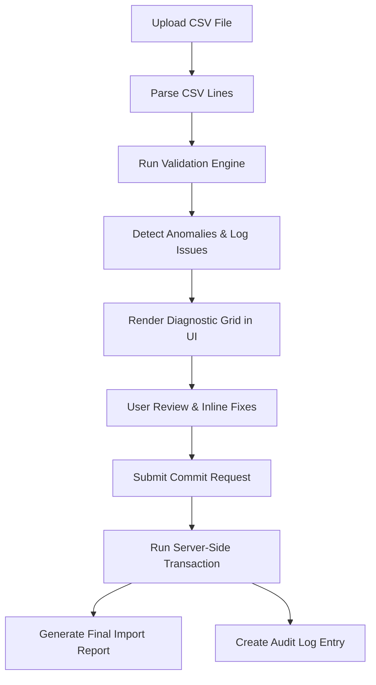
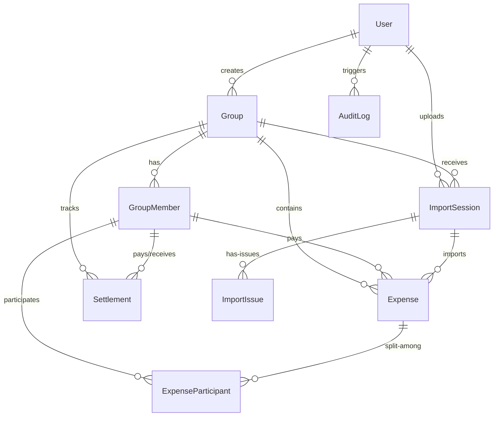

# ExpenseFlow: Scope & System Architecture Documentation
**Shared Expenses Management Web App**

---

## Section 1: Project Scope

### Project Overview
**ExpenseFlow** is a production-grade, collaborative expense management application designed for groups to track joint expenditures, manage member balances, and resolve outstanding debts. The application moves beyond basic calculators by enforcing relational consistency, timeline-aware splits, and a structured CSV import system that handles real-world data issues without silent corruption.

The application’s user interface is built around a custom **Neo-Brutalist Sketchbook Journal theme** (also referred to as the "Neo-Brutalist Doodle UI"). This distinct visual system is styled to look like a physical bullet journal, featuring:
* A persistent **radial dot-grid background** resembling notebook paper.
* **Handwritten typography** using Google Fonts: *Architects Daughter* for headers/titles, *Comic Neue* for general body text and forms, and *Caveat* for handwritten callouts, sidebars, and annotations.
* **Neo-Brutalist Borders**: Container cards, input elements, and buttons utilize flat, heavy 3px solid borders, sharp offset shadow boxes rather than soft gradients or blurs, and tactile feedback (hovering moves elements up-left, while clicking depresses them down-right).
* **Highlighter Accents**: Pastel marker highlights (yellow, cyan, pink) draw visual focus to active menus, category badges, and validation alerts.
* **Hand-Drawn Avatar System**: Built-in sprites mapping to distinct group personas (e.g., *Johnny Cap* the forgetful spender, *Sarah Mathers* the six-decimal accountant, *Emily Spacebuns* the timeline-defying participant, and *Dave Ironfist* the spreadsheet auditor) generated dynamically by hashing user names and emails.

### Objectives
1. **Financial Precision**: Protect group financial ledgers from decimal drift, rounding discrepancies, and currency conversion mismatches.
2. **Timeline-Aware Splits**: Prevent transactions from being split with members who were not active in the group on the date of the transaction.
3. **Data Integrity & Traceability**: Guarantee that all spreadsheet uploads are validated, audited, and reviewed by users rather than blindly committed, ensuring a clear electronic paper trail.
4. **Optimal Settlement Paths**: Minimize the complexity and volume of peer-to-peer bank transfers using a mathematical graph solver.

### Features Implemented
* **Roster-Restricted Calendars (Dynamic Membership)**: Every group member is assigned a `joinDate` and an optional `leaveDate`. The transaction engine cross-references the date of each expense with the active membership windows of the payers and participants to ensure valid split allocations.
* **Graph Collapsing Solver**: A greedy optimization algorithm designed to simplify multi-party debt vectors. It consolidates multiple circular debts into the minimum number of direct, simplified settlement transactions.
* **Smart CSV Import Wizard & Diagnostic Panel**: An interactive pipeline that parses CSV files, highlights validation issues, allows inline corrections, and issues detailed import reports upon commitment.
* **Dynamic Ledgers & Balances**: Real-time rendering of group spending history, calculated individual balances, and step-by-step resolution paths.

### In-Scope Functionalities
* **Authentication & Role Control**: User registration and login protected by JSON Web Tokens (JWT) stored in HTTP-only cookies or authorization headers.
* **Group Management**: Creating groups, selecting group-wide base currencies (USD, INR, EUR), and maintaining a roster of active and inactive members.
* **Expense Management**: Logging individual expenses with a title, amount, currency, date, paid-by member, split type, description, notes, and attachment link.
* **Flexible Split Algorithms**:
  * **EQUAL**: Divides the total cost equally among participants, with rounding remainder cents allocated to the first participant.
  * **PERCENTAGE**: Allocates costs by percentage, validating that the sum equals exactly 100%.
  * **EXACT / CUSTOM**: Direct allocation of specific currency amounts, validating that the sum matches the total expense amount.
  * **SHARES**: Allocates proportional costs based on integer weights, automatically distributing cents.
* **Interactive CSV Diagnostic Wizard**: A full UI view displaying parsed CSV lines, highlighting errors (red markers) and warnings (yellow flags), permitting inline input editing, and batch-approving warnings/infos.
* **Settlement Ledger**: Recording debt payments between group members to adjust balances.
* **System Auditing**: Automatic logging of administrative events (e.g., CSV uploads, database commits, group creations) to an audit log database.

### Out-of-Scope Functionalities
* **Real-world Payment Processing**: Integration with third-party payment gateways (e.g., Stripe, PayPal, Venmo, UPI) to execute actual monetary transfers. Settlements are recorded as administrative updates within the ledger only.
* **External Real-Time Currency API Sync**: Automatic fetching of live exchange rates from external web services during transaction processing. The system uses pre-populated database exchange rates to maintain predictability and avoid external network failures during transactions.
* **Cross-Group Debt Consolidation**: Simplifying balances for a single user across multiple separate groups. Debts are strictly isolated inside their respective group containers.
* **Automatic OCR Receipt Scanning**: Scanning uploaded receipt images to auto-populate expense fields. All CSV files must be text-based, and receipt attachments are stored strictly as static asset URLs.

---

## Section 2: CSV Import Scope

The CSV import pipeline is designed to act as a robust gatekeeper for the database. Instead of forcing users to pre-process spreadsheets locally or silently dropping rows that contain errors, the application imports the CSV file **exactly as provided**. The server and client work in tandem to parse, identify, review, and fix anomalies.

### The CSV Import Life Cycle

#### Detailed Flow Description
1. **Upload CSV**: The user selects a CSV file in the React frontend and uploads it to the backend `POST /api/groups/:groupId/imports` endpoint via a multipart form request.
2. **Parse**: The backend utilizes a robust parser that handles quotes and commas correctly (e.g., escaping commas inside quote boundaries such as `"Truffle, Cheese"`) and extracts the raw text array.
3. **Validate & Detect Anomalies**: The server-side validation utility (`checkRowAnomalies`) evaluates each row against 13 diagnostic rules.
   * If any anomaly is detected, the parser notes the issue type, severity (`ERROR`, `WARNING`, or `INFO`), a user-friendly description, and a suggested resolution action.
   * An `ImportSession` is created in the database with a `status` of `PENDING`.
   * For every row containing anomalies, corresponding `ImportIssue` records are inserted, linked directly to the parent `ImportSession`.
4. **User Review**: The frontend retrieves the list of issues for the session. It renders a sketchbook-themed diagnostic table where:
   * **Errors** (blocking import) are highlighted in pastel pink/red.
   * **Warnings** (non-blocking but dangerous) are highlighted in pastel yellow.
   * **Info** items are highlighted in pastel blue/gray.
   * Users can double-click on fields (such as dates, amounts, or payer emails) to edit them inline.
5. **Apply Fixes & Resolve**:
   * The user can resolve issues individually by editing values or setting actions to `APPROVE`, `REJECT`, or `IGNORE`.
   * The user can execute **Batch Actions** to resolve all non-blocking warnings or info alerts in one click (e.g., batch-approving all unknown member invites or currency fallbacks). Critical errors *cannot* be batch-approved; they must be individually resolved or skipped.
6. **Import Data (Commit)**: When the user clicks "Commit Import", the frontend sends the finalized, resolved array of rows along with their user-approved actions to `POST /api/imports/:sessionId/commit`.
   * The backend processes the commit inside a single database transaction (`tx` block).
   * **Auto-Invite**: If a payer or split participant email is not in the group roster and the row is approved, the system automatically creates a new `GroupMember` with `status` set to `ACTIVE` and backdates their `joinDate` to match the transaction date.
   * **Currency Conversion**: Non-base currencies are converted to the group's base currency using the stored rates in the `ExchangeRate` model, while the original values (`amount` and `currency`) are preserved.
   * **Split Calculations**: The transaction engine validates the splits and calculates the exact base-currency shares.
7. **Generate Report**: The database session state is updated to `COMPLETED`, recording the number of rows imported and skipped. The frontend renders a clean, summary card showing success metrics, skipped counts, and created accounts.
8. **Audit Log**: An `AuditLog` entry is written to record the completion metrics, providing full administrative transparency.

---

## Section 3: Anomaly Log

Below is the structured catalog of validation rules used by the ExpenseFlow parsing engine.

### Anomaly Summary Table

| Rule Code | Severity | Description | Detection Logic | Action Taken | Reason |
| :--- | :--- | :--- | :--- | :--- | :--- |
| **MALFORMED_ROW** | `ERROR` | Column mismatch between row and header. | `rowColumns.length !== headersCount` | Skip row or block import until fixed. | Prevents database insertion of misaligned arrays. |
| **BLANK_FIELD** | `ERROR` | Missing required values (Title, Date, Amount, Payer). | `!rowData.title \|\| !rowData.amount...` | Flag input as red; block commit. | Prevents incomplete, orphan financial entries. |
| **MISSING_PAYER** | `ERROR` | Payer email column is empty. | `!rowData.paidByEmail` | Block commit; force email selection. | Every expense must have an accountable payer. |
| **NEGATIVE_AMOUNT** | `ERROR` | Amount is zero, negative, or not a number. | `parseFloat(amount) <= 0` | Flag error; block until corrected to positive. | Financial ledgers cannot contain negative costs. |
| **INVALID_DATE** | `ERROR` | Date format cannot be parsed by standard engines. | `isNaN(Date.parse(date))` | Block commit; force YYYY-MM-DD format. | Prevents calendar indexing corruption in db. |
| **FUTURE_DATE** | `WARNING` | Date is set beyond system's current time. | `date.getTime() > Date.now()` | Show warning flag; allow user to override. | Accommodates planned, forward-dated expenses. |
| **INVALID_CURRENCY**| `WARNING` | Currency code not in supported list (USD/INR/EUR). | `!supported.includes(currency)` | Warn user; convert to group base currency. | Avoids unconvertible currency codes. |
| **UNKNOWN_MEMBER** | `WARNING` | Email is not registered in the group roster. | `!groupEmails.includes(email)` | Warn user; auto-create member if approved. | Seamlessly updates group rosters during import. |
| **MEMBER_INACTIVE** | `WARNING` | Date falls outside member's active windows. | `date < joinDate \|\| date > leaveDate` | Warn user; allow split override. | Protects users from being billed when away. |
| **SETTLEMENT_FLAG** | `INFO` | Keywords indicate transaction is a debt payout. | Checks title/desc for "settle", "repay". | Suggests converting to Settlement type. | Keeps expense splits and settlements distinct. |
| **INCORRECT_SPLIT**| `ERROR` | Split allocations do not match amount or 100%. | Math checks on shares/percentages. | Block commit; fallback to EQUAL if requested. | Guarantees split math is mathematically sound. |
| **DUPLICATE** | `WARNING` | Identical expense exists in database. | Exact match on Title, Amount, Date, Payer. | Flag warning; prompt user to skip or import. | Prevents double-billing due to double-clicks. |
| **DUPLICATE_DIFFERENT_AMOUNT** | `WARNING` | Similar expense exists but with a different amount. | Match on Title, Date, Payer; different Amount. | Flag warning; prompt user to review amount. | Detects potential input errors or revision offsets. |

---

### Deep-Dive Anomaly Policy Explanations

#### 1. MALFORMED_ROW
* **Description**: A row containing more or fewer comma-separated fields than the defined header configuration (11 columns).
* **Detection Strategy**: The parser counts tokens in the array resulting from splitting the row string (while respecting quotation boundaries). If `length !== 11`, a `MALFORMED_ROW` is flagged.
* **User Experience**: The diagnostic grid shows a completely blocked row with a red outline. Fields cannot be edited individually because they are misaligned. The user must either edit the raw CSV text in the source editor or choose to skip the row entirely.
* **Final Import Action**: Row is rejected and skipped unless the source file is updated.
* **Why this Policy was Selected**: If a row has a column mismatch, attempting to map fields (e.g., mapping notes into the amount field) would corrupt data integrity. Preventing parsing is the safest option.

#### 2. BLANK_FIELD
* **Description**: One or more critical fields—specifically `Title`, `Amount`, `Date`, or `PaidByEmail`—are missing values.
* **Detection Strategy**: Checks if string lengths of target properties are equal to zero after trimming whitespace.
* **User Experience**: The grid displays a red warning icon next to the empty cell. The "Commit" button is disabled. The user can type the missing details directly into the cell.
* **Final Import Action**: Blocked until values are supplied, or the row is rejected.
* **Why this Policy was Selected**: Incomplete database entries cause null-pointer exceptions in calculation algorithms. Expense title, date, amount, and payer are non-nullable database columns.

#### 3. MISSING_PAYER
* **Description**: The row has a blank string or a missing value in the `PaidByEmail` column.
* **Detection Strategy**: Identical to `BLANK_FIELD` check, but targeted specifically at the payer column to provide a clearer suggestion.
* **User Experience**: The cell is highlighted in pink. Hovering displays "Payer email is missing." The user can select a member from a dropdown menu populated from the group roster.
* **Final Import Action**: Blocked from import until a valid email address is assigned.
* **Why this Policy was Selected**: In double-entry ledger bookkeeping, a debt vector cannot exist without a source node (the payer).

#### 4. NEGATIVE_AMOUNT
* **Description**: The transaction value is less than or equal to zero, or is a non-numeric string.
* **Detection Strategy**: Converts the amount column via `parseFloat()`. If `isNaN(value)` or `value <= 0`, a `NEGATIVE_AMOUNT` anomaly is added.
* **User Experience**: Cell is highlighted in red. The user must edit the amount to a positive number.
* **Final Import Action**: Blocked from database entry until corrected to a positive decimal.
* **Why this Policy was Selected**: Negative expenses are mathematically equivalent to income or settlements. Recording them as expenses distorts group spending analytics and ruins balance calculations.

#### 5. INVALID_DATE
* **Description**: The transaction date field contains random text, invalid formats, or non-existent calendar dates (e.g., `2024-02-31`).
* **Detection Strategy**: Parses the date string using standard JS engine logic: `Date.parse(dateString)`. If the resulting timestamp is `NaN`, it is flagged.
* **User Experience**: A red flag appears in the date cell. The cell value can be edited to a standard `YYYY-MM-DD` date.
* **Final Import Action**: Import is blocked until the date can be parsed successfully.
* **Why this Policy was Selected**: Accurate chronological ordering is required for member activity window matching and timeline-aware splits.

#### 6. FUTURE_DATE
* **Description**: The transaction date is set in the future relative to the system server time.
* **Detection Strategy**: Compares the parsed date timestamp against `Date.now()`.
* **User Experience**: The date cell displays a yellow warning triangle. The system does not block submission but requests confirmation.
* **Final Import Action**: Allowed to import if approved by the user.
* **Why this Policy was Selected**: Future dating is common for recurring bills or planned trips, so blocking it would hinder flexibility. However, warning the user prevents accidental typos (e.g., typing `2036` instead of `2026`).

#### 7. INVALID_CURRENCY
* **Description**: The transaction currency code is unsupported (supported list is USD, INR, EUR).
* **Detection Strategy**: Standardizes the string to uppercase and checks if `supportedCurrencies.includes(currency)`.
* **User Experience**: Displays a yellow warning badge in the currency column. Suggests converting to the group's base currency or changing the currency code.
* **Final Import Action**: If approved without changes, the system automatically falls back to the group's base currency.
* **Why this Policy was Selected**: Unsupported currency codes prevent accurate exchange rate conversions, which would crash calculations.

#### 8. UNKNOWN_MEMBER
* **Description**: The payer email or one of the split participant emails does not exist in the current group member roster.
* **Detection Strategy**: Checks if emails exist in the roster of `GroupMember` entries for that group.
* **User Experience**: A yellow warning label appears. The tooltip indicates that the member is unknown. The user can either approve the row (which triggers an auto-invite) or edit the email to match an existing member.
* **Final Import Action**: Auto-invites the unknown email on commit (creating a new active member) if approved, or rejects the row.
* **Why this Policy was Selected**: Auto-inviting members prevents spreadsheet imports from failing when new members are added to a group. This reduces manual roster maintenance.

#### 9. MEMBER_INACTIVE
* **Description**: The expense date is outside the active membership window of the payer or a split participant.
* **Detection Strategy**: Compares the transaction date against `joinDate` and `leaveDate` of the mapped group members.
* **User Experience**: Displays a warning alert stating "Member was not active on this date." The user is given an option to override (which backdates the join date of that member to match the transaction date) or edit the transaction date.
* **Final Import Action**: Overrides and adjusts the member's timeline if approved; otherwise, blocks split allocation.
* **Why this Policy was Selected**: Ensures members are not charged for expenses incurred before they joined or after they left.

#### 10. SETTLEMENT_FLAG
* **Description**: Text patterns inside the title or description match common debt-repayment terms.
* **Detection Strategy**: Checks if keywords like `settle`, `repay`, `payment`, or `paid back` are in the string.
* **User Experience**: An informational blue badge is displayed. The interface offers a checkbox: "Convert to Settlement transaction?"
* **Final Import Action**: If checked, the row is imported as a `Settlement` record instead of an `Expense` record.
* **Why this Policy was Selected**: Keeps settlements separate from normal expenses to maintain accurate group spending statistics and net balance calculations.

#### 11. INCORRECT_SPLIT
* **Description**: The split proportions do not sum to 100% (for percentages), do not match the total amount (for exact splits), or have no participants selected.
* **Detection Strategy**: Calls `calculateSplits()` on the row data. If the returned validation property `valid` is false, it returns the error string.
* **User Experience**: Shows a red border around the split values field, displaying the math discrepancy (e.g., "Percentages must sum to 100%"). The user can correct the split numbers or toggle to an equal split.
* **Final Import Action**: Blocks the import of that row until split math is valid.
* **Why this Policy was Selected**: Incorrect split calculations create unbalanced ledger entries where the total paid does not match the sum of participant shares.

#### 12. DUPLICATE
* **Description**: A duplicate entry matches an existing transaction already logged in the group's ledger.
* **Detection Strategy**: Queries the database for any expense in the group with the exact same Title, Amount, Date, and Payer Email.
* **User Experience**: Displays a yellow warning indicating an identical transaction exists. The user can select "Skip Duplicate" or "Import Anyway".
* **Final Import Action**: Skips row or imports a new record based on user selection.
* **Why this Policy was Selected**: Preventing silent duplicate imports protects groups from double-entry errors caused by duplicate CSV uploads.

#### 13. DUPLICATE_DIFFERENT_AMOUNT
* **Description**: A transaction matches an existing entry in Title, Date, and Payer, but has a different amount.
* **Detection Strategy**: Searches database for records matching Title, Date, and Payer Email, but where `Math.abs(dbAmount - rowAmount) >= 0.01`.
* **User Experience**: Displays a yellow warning stating "A similar transaction exists but with a different amount." Provides options to import or skip.
* **Final Import Action**: Skips or imports depending on user choice.
* **Why this Policy was Selected**: Helps catch cases where a user might be importing an edited or corrected version of an existing expense, or where a typo was made in the amount column.

---

## Section 4: Product Decisions

### 1. Duplicate Expenses Require User Approval
* **Product Decision**: When a duplicate transaction (matching Title, Date, Payer Email, and Amount) is detected during a CSV import, the application flags it as a warning and requests manual approval instead of automatically deleting or skipping the row.
* **Rationale**: In group dynamics, it is possible to have two identical transactions on the same day (e.g., buying two separate rounds of coffee at the same shop for the same price). Automatically deleting duplicates could result in missing transactions. Requesting user approval ensures the user remains in control.

### 2. Settlements Stored Separately from Expenses
* **Product Decision**: Settlements (peer-to-peer repayments) are stored in their own database table (`Settlement`) rather than as negative-value expenses in the `Expense` table.
* **Rationale**: Expenses and settlements represent different types of transactions. Expenses represent group consumption and are used to calculate spending analytics, whereas settlements are purely transfer transactions used to balance outstanding debts. Storing them in separate tables keeps the business logic clean and prevents settlements from skewing spending metrics.

### 3. Timeline-Restricted Splits
* **Product Decision**: Group members can only participate in expenses that occur within their active membership window (`joinDate` to `leaveDate`). 
* **Rationale**: In long-running groups (e.g., shared housing), flatmates join and leave at different times. Traditional splitting tools require users to manually adjust rosters for each transaction. By enforcing membership timelines, the system automatically excludes inactive members from splits, preventing billing errors.

### 4. Multi-Currency Value Preservation
* **Product Decision**: Multi-currency expenses are converted to the group's base currency using rates stored in the database, while the original payment value (`amount` and `currency`) is preserved.
* **Rationale**: Groups need to know how much was spent in their base currency to calculate balances. However, members need to see the original transaction currency and amount (e.g., an export invoice or local dinner cost) to verify receipt values. Storing both values provides transparency and simplifies auditing.

### 5. No Silent Data Modifications during CSV Imports
* **Product Decision**: The import engine will never modify, truncate, or correct user data without notifying the user. Every anomaly must be displayed in the diagnostic UI for review.
* **Rationale**: Automated heuristics (such as auto-converting invalid dates or rounding splits) can lead to silent errors. By displaying all warnings and errors in the diagnostic interface, the application ensures the user has full visibility and control over the imported data.

---

## Section 5: Database Schema

ExpenseFlow uses **PostgreSQL** as its database engine and **Prisma ORM** as the database client. Below is the detailed breakdown of the schema models.

### Models and Tables

#### 1. User
* **Purpose**: Stores account authentication details, profiles, and roles for registered users.
* **Fields**:
  * `id`: `String` (UUID) | **Primary Key**
  * `email`: `String` | **Unique Index**
  * `passwordHash`: `String`
  * `name`: `String`
  * `avatarUrl`: `String?` (Optional)
  * `role`: `String` (Defaults to `"USER"`)
  * `createdAt`: `DateTime` (Defaults to `now()`)
  * `updatedAt`: `DateTime` (Managed by Prisma `@updatedAt`)
* **Relationships**:
  * `groups`: One-to-Many relation with `Group` (Groups created by this user).
  * `sessions`: One-to-Many relation with `ImportSession` (CSV sessions uploaded by this user).
  * `auditLogs`: One-to-Many relation with `AuditLog`.

#### 2. Group
* **Purpose**: Represents a shared expense container (e.g., a trip or shared apartment ledger).
* **Fields**:
  * `id`: `String` (UUID) | **Primary Key**
  * `name`: `String`
  * `description`: `String?`
  * `baseCurrency`: `String` (Defaults to `"USD"`)
  * `createdAt`: `DateTime`
  * `updatedAt`: `DateTime`
  * `createdById`: `String` | **Foreign Key** (references `User.id`)
* **Relationships**:
  * `createdBy`: Belongs to `User`.
  * `members`: One-to-Many relation with `GroupMember`.
  * `expenses`: One-to-Many relation with `Expense`.
  * `settlements`: One-to-Many relation with `Settlement`.
  * `importSessions`: One-to-Many relation with `ImportSession`.

#### 3. GroupMember
* **Purpose**: Tracks group rosters, including registered users and invited/placeholder members, along with active membership windows.
* **Fields**:
  * `id`: `String` (UUID) | **Primary Key**
  * `groupId`: `String` | **Foreign Key** (references `Group.id`, cascades on delete)
  * `userId`: `String?` | **Foreign Key** (Optional link to `User.id`)
  * `email`: `String`
  * `name`: `String`
  * `joinDate`: `DateTime` (Defaults to `now()`)
  * `leaveDate`: `DateTime?` (Optional)
  * `status`: `String` (Defaults to `"ACTIVE"`)
  * `createdAt`: `DateTime`
* **Constraints**:
  * Unique index on composite key `[groupId, email]`.
* **Relationships**:
  * `group`: Belongs to `Group`.
  * `paidExpenses`: One-to-Many relation with `Expense` (Expenses paid by this member).
  * `shares`: One-to-Many relation with `ExpenseParticipant` (Splits this member is involved in).
  * `paidSettlements`: One-to-Many relation with `Settlement` (as Payer).
  * `receivedSettlements`: One-to-Many relation with `Settlement` (as Payee).

#### 4. Expense
* **Purpose**: Records individual expense details inside a group.
* **Fields**:
  * `id`: `String` (UUID) | **Primary Key**
  * `groupId`: `String` | **Foreign Key** (references `Group.id`, cascades on delete)
  * `title`: `String`
  * `description`: `String?`
  * `amount`: `Float` (Original amount paid)
  * `currency`: `String` (Original currency)
  * `amountInBase`: `Float` (Amount converted to Group's `baseCurrency`)
  * `date`: `DateTime`
  * `paidById`: `String` | **Foreign Key** (references `GroupMember.id`, cascades on delete)
  * `splitType`: `String` (Defaults to `"EQUAL"`)
  * `notes`: `String?`
  * `attachmentUrl`: `String?`
  * `importSessionId`: `String?` | **Foreign Key** (references `ImportSession.id`, set null on delete)
  * `createdAt`: `DateTime`
  * `updatedAt`: `DateTime`
* **Relationships**:
  * `group`: Belongs to `Group`.
  * `paidBy`: Belongs to `GroupMember`.
  * `importSession`: Belongs to `ImportSession`.
  * `participants`: One-to-Many relation with `ExpenseParticipant`.

#### 5. ExpenseParticipant (Logical Entity: *ExpenseSplit*)
* **Purpose**: Stores the split details for each participant in an expense.
* **Fields**:
  * `id`: `String` (UUID) | **Primary Key**
  * `expenseId`: `String` | **Foreign Key** (references `Expense.id`, cascades on delete)
  * `memberId`: `String` | **Foreign Key** (references `GroupMember.id`, cascades on delete)
  * `shareValue`: `Float` (Value input: e.g., percentage, exact amount, or shares)
  * `calculatedShare`: `Float` (Actual cost owed in the original transaction currency)
  * `calculatedShareInBase`: `Float` (Actual cost owed in the Group's base currency)
* **Relationships**:
  * `expense`: Belongs to `Expense`.
  * `member`: Belongs to `GroupMember`.

#### 6. Settlement
* **Purpose**: Records peer-to-peer repayments to settle outstanding balances.
* **Fields**:
  * `id`: `String` (UUID) | **Primary Key**
  * `groupId`: `String` | **Foreign Key** (references `Group.id`, cascades on delete)
  * `payerId`: `String` | **Foreign Key** (references `GroupMember.id`, cascades on delete)
  * `payeeId`: `String` | **Foreign Key** (references `GroupMember.id`, cascades on delete)
  * `amount`: `Float` (Original repayment amount)
  * `currency`: `String`
  * `amountInBase`: `Float` (Repayment converted to Group base currency)
  * `date`: `DateTime` (Defaults to `now()`)
  * `notes`: `String?`
  * `status`: `String` (Defaults to `"SETTLED"`)
  * `createdAt`: `DateTime`
* **Relationships**:
  * `group`: Belongs to `Group`.
  * `payer`: Belongs to `GroupMember`.
  * `payee`: Belongs to `GroupMember`.

#### 7. ImportSession (Logical Entity: *ImportLog*)
* **Purpose**: Tracks details and status of uploaded CSV files.
* **Fields**:
  * `id`: `String` (UUID) | **Primary Key**
  * `groupId`: `String` | **Foreign Key** (references `Group.id`, cascades on delete)
  * `uploadedById`: `String` | **Foreign Key** (references `User.id`)
  * `fileName`: `String`
  * `status`: `String` (Defaults to `"PENDING"`)
  * `totalRows`: `Int`
  * `importedRows`: `Int`
  * `skippedRows`: `Int`
  * `createdAt`: `DateTime`
* **Relationships**:
  * `group`: Belongs to `Group`.
  * `uploadedBy`: Belongs to `User`.
  * `issues`: One-to-Many relation with `ImportIssue`.
  * `expenses`: One-to-Many relation with `Expense`.

#### 8. ImportIssue (Logical Entity: *ImportAnomaly*)
* **Purpose**: Logs validation issues and anomalies detected in uploaded CSV rows.
* **Fields**:
  * `id`: `String` (UUID) | **Primary Key**
  * `sessionId`: `String` | **Foreign Key** (references `ImportSession.id`, cascades on delete)
  * `rowIndex`: `Int`
  * `rowData`: `String` (Stringified JSON representation of the original row data)
  * `issueType`: `String`
  * `severity`: `String`
  * `description`: `String`
  * `suggestedAction`: `String`
  * `status`: `String` (Defaults to `"PENDING"`)
  * `resolvedData`: `String?` (Stringified JSON of modified row data applied by user)
* **Relationships**:
  * `session`: Belongs to `ImportSession`.

#### 9. ExchangeRate
* **Purpose**: Stores static exchange rates for currency conversions.
* **Fields**:
  * `id`: `String` (UUID) | **Primary Key**
  * `fromCurrency`: `String`
  * `toCurrency`: `String`
  * `rate`: `Float`
  * `updatedAt`: `DateTime`
* **Constraints**:
  * Unique index on composite key `[fromCurrency, toCurrency]`.

#### 10. AuditLog
* **Purpose**: Stores audit logs for administrative events.
* **Fields**:
  * `id`: `String` (UUID) | **Primary Key**
  * `userId`: `String?` | **Foreign Key** (references `User.id`, sets null on delete)
  * `action`: `String`
  * `details`: `String`
  * `ipAddress`: `String?`
  * `createdAt`: `DateTime`
* **Relationships**:
  * `user`: Belongs to `User`.

---

### Entity-Relationship Diagram (Mermaid)

---

## Section 6: Design Justification

During initial planning, the database options were evaluated: **PostgreSQL (Relational)** and **MongoDB (Document-based)**. We selected **PostgreSQL** (hosted via Neon Cloud API) for the following reasons:

### 1. Relational Integrity and Foreign Key Constraints
Shared expense ledgers rely heavily on relational links. For example, an `ExpenseParticipant` entry must reference a valid `GroupMember` and `Expense`. 
* **PostgreSQL** enforces these relationships natively using foreign key constraints and cascade rules (e.g., `ON DELETE CASCADE`). This prevents orphan records and ensures database integrity.
* **MongoDB** does not enforce relational links. If a user was deleted, the system would need custom application-level cleanup logic to prevent orphan records. This increases code complexity and risks data inconsistency.

### 2. ACID Transactions
Splitting expenses and committing CSV files requires executing multiple queries together (e.g., writing the expense, creating split entries, inviting new users, and updating import logs). 
* **PostgreSQL** provides robust support for ACID transactions. If any query within the transaction block fails, the entire transaction is rolled back. This prevents partial writes (e.g., creating an expense record without its associated participant splits).
* While **MongoDB** supports multi-document transactions, doing so introduces significant performance overhead and setup complexity. PostgreSQL handles these concurrent transactional writes natively.

### 3. Financial Consistency
Financial applications require strict data validation. Floating-point calculations can introduce rounding errors when calculating splits.
* **PostgreSQL** supports precise numeric data types and allows us to run validation checks directly on the database engine.
* **MongoDB** uses dynamic schemas, which can lead to data types being mixed up (e.g., storing a number as a string). This can lead to calculations failing during runtime.

### 4. Complex Joins
Generating reports and calculating group balances requires joining multiple tables (e.g., aggregating `Expenses` paid by a member and subtracting their `ExpenseParticipant` split totals).
* **PostgreSQL** executes these join and aggregation queries efficiently using SQL.
* In **MongoDB**, these calculations require running complex aggregation pipelines (`$lookup`, `$unwind`, `$group`). These pipelines are harder to write and maintain, and can be less efficient than native SQL joins.

---

## Section 7: Scalability Considerations

As group transaction logs and CSV sizes scale up, system bottlenecks can occur. Below is the scalability strategy for ExpenseFlow.

### 1. Indexing Strategy
To ensure query performance remains fast as the database grows, indexes are created on frequently queried columns and foreign keys:
* **Composite Index** on `GroupMember(groupId, email)`: Speeds up email checks and roster validations during CSV uploads.
* **Indexes on Foreign Keys**: Indexes are created on `groupId` and `memberId` fields inside the `Expense`, `ExpenseParticipant`, and `Settlement` tables. This speeds up joins when generating balance summaries.
* **Composite Index** on `ExchangeRate(fromCurrency, toCurrency)`: Speeds up currency conversion rate lookups.

### 2. Pagination Strategy
Ledger pages can slow down if they attempt to load thousands of historic transactions at once.
* **Cursor-Based Pagination** is used for transaction ledgers. This queries rows matching `date < last_seen_date` and `id < last_seen_id` with a strict `LIMIT`.
* This prevents the performance degradation associated with offset-based pagination (e.g., `OFFSET 10000`), which requires the database to scan all preceding records.

### 3. Batch Commit Processing
Uploading large CSV files (e.g., containing 10,000+ rows) can exhaust database connections if each row is processed and inserted individually.
* **Chunking**: The server-side importer splits rows into chunks (e.g., 500 rows per chunk).
* **Prisma `$transaction`**: Each chunk is committed in a single transaction using batch inserts (`createMany`). This reduces roundtrips to the database and keeps transaction windows short.

### 4. Interactive Transaction Scopes
During CSV commits, new users might be auto-invited.
* To prevent duplicate key errors if two threads attempt to auto-invite the same member simultaneously, the system uses **interactive transactions** with an `ISOLATION LEVEL` set to `READ COMMITTED`.
* Row-level locking ensures that concurrent writes to the same member roster are serialized.

### 5. Audit Logging Architecture
Administrative actions generate a high volume of audit logs.
* To prevent audit log writes from blocking core transaction queries, log writes are processed **asynchronously**. The application writes logs to a queue, which is processed in the background, keeping main request cycles fast.

### 6. Scalability for Multiple Groups & Currencies
* **Multi-Group Isolation**: Data queries are locked to a `groupId` parameter, allowing future horizontal scaling (e.g., sharding the database by `groupId` across different server nodes).
* **Multi-Currency Support**: Exchange rates are stored in a dedicated lookup table (`ExchangeRate`). This allows the system to support new currencies by adding rows to this table, without requiring any schema migrations or code changes.

---

## Section 8: Conclusion

**ExpenseFlow** combines technical engineering with user-focused product design to solve the challenges of shared expense tracking.

* **As a Product Manager**, the application ensures a user-friendly experience during CSV uploads. Instead of throwing errors or silently modifying data, the system flags anomalies in an interactive diagnostic interface, giving users full control over how errors are resolved.
* **As a Software Developer**, the system is built with a relational PostgreSQL schema, database-level validation, and transactional integrity. Enforcing timeline-aware splits and separating expenses from settlements ensures the underlying ledger remains accurate and auditable.

By aligning user-centered features (such as timeline-aware splits and auto-invitations) with strict database validation, ExpenseFlow demonstrates a balanced approach to building production-grade financial applications.
